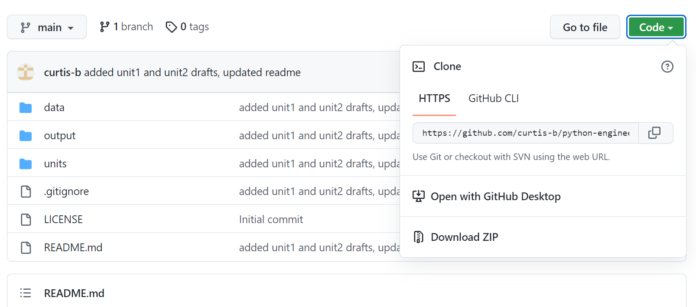
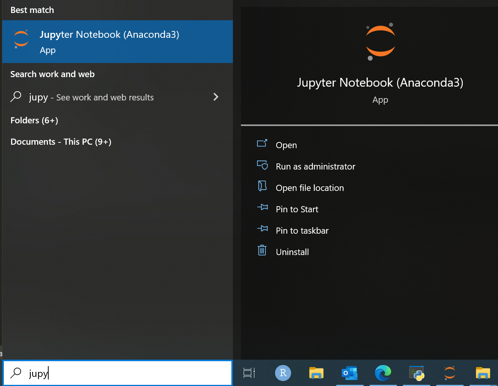

# Python for Engineering Analytics - Getting Started

## Preface

The ability to analyze large datasets is key to solving many engineering challenges. Many engineers will be familiar with spreadsheets or specialized statistical analysis applications for basic data analysis tasks. However, these options can be inefficient for large datasets (leading to slow processing or program crashes), more difficult to automate (to reduce/eliminate routine data processing steps) and do not offer the breadth of tools needed to support more sophisticated forecasting and/or machine-learning analysis.

This course seeks to introduce the (non-programmer) engineer to the Python programming language through a series of lessons focused on getting up and running with engineering data analysis. Our focus will not be on computer science fundamentals, algorithm design or data structures. Instead, we'll practice loading and processing actual engineering datasets to demonstrate that you don't need formal computer science training to understand and get started with data analysis in Python. References for more information will be provided so that, as your interest and experience grow, you'll know where to go to continue learning. 

### Course goals:

- Understand the capabilities and benefits of using Python for engineering data analysis.
- Be comfortable opening, executing and creating basic Python code for engineering data analysis using Jupyter notebooks.
- Load an existing dataset, and complete typical engineering analysis tasks (descriptive statistics, visualization, regression, statistical testing) using common Python data analysis libraries: `numpy`, `pandas`, `scipy` and `matplotlib`
- Know where to go to continue learning about data analysis and Python (courses, websites, books, ...)

## What is Python?

[Python](https://www.python.org/) is a free-to-use, open-source, programming language that is a popular choice for data science projects. As a full-featured programming language, you can use Python to write short programs a few lines long to automate data analysis and plotting up to desktop applications with a graphical user interface. In this course we will focus on the former, but know that your programs can grow in complexity as you develop programming skills and understand what is possible!

- **free-to-use**: there is no cost for you to download and use Python
- **open-source**: the source code that comprises Python is made available and can be modified by users [https://docs.python.org/3/license.html]

## Why analyze data in Python?

### Flexibility

### Automation

### Speed

## Installing Python on your computer

There are several ways to install the Python language interpreter on your computer. One of the simplest ways to get up and running quickly is to use the popular [Anaconda Distribution](https://www.anaconda.com/products/distribution) of Python, which conveniently bundles all of the packages that we'll be using in this course into a single installation step. Because it should not require any additional setup, I recommend that you take this route versus installing the required packages individually via pip or miniconda.

One downside to using the standard Anaconda distribution can be package version incompatibility. 

## Downloading the course files

*Version control systems* such as [`git`](https://git-scm.com/) are commonly used to manage and distribute the source code for programming projects. Without getting into too much detail, this system allows for multiple users to contribute to a programming project in an coordinated way, while maintaining version control of all of the files. You can think of it sort of like enabling the *Track Changes* feature in an office document. When changes are completed they are posted to a server that is accessible to the team members, such as [github](https://github.com/) or [gitlab](https://gitlab.com/).

An existing repository or *repo* can be initially copied to a user's computer by using the `clone` operation. When a contributor makes a change to a file, he/she can `push` that change to a server so that it is available to the team. Conversely, a `pull` downloads the latest updates from the server to the user's computer.

The files for this course are provided in a public github repository for you to clone/download:

- [https://github.com/curtis-b/python-engineering-analytics]

If you are already a git user, you can clone the repo and you're ready to go on to the next step. However, you don't need to set up git or understand how to use it to get the files. Instead, choose the *Download ZIP* option under the *Code* button, and you'll be able to extract all of the files to a directory on your computer. You won't need to understand any more about git to move through the data analysis examples.

### Structure of the git repo directory

| Directory | Contents |
|-----------|----------|
| `/.git` | The database for the git repo (files, version history, ...). You won't need anything here. |
| `/assets` | Non-code files (such as images, screenshots). |
| `/data`  | Engineering data sets used in the example code. |
| `/output` | Empty folder where you will save data and plots while completing the the examples. |
| `/units` | This is where you will find the course lesson files. |

## Getting started with Jupyter notebooks

For this course, we will run Python code using [Jupyter notebooks](https://jupyter.org/). Notebooks are just one of several ways that you can execute Python programs, but they offer some convenient features for data science and teaching. If you have used ``R markdown'' in the past, there are some similarities to Jupyter notebooks.

When you run the Jupyter notebook application on your computer, two things happen. First, the application starts a local application that acts as a server, to process the Python code that you execute inside of the notebook. This will look like a console window on Windows PC. Second, a file browser will open as a web page in your default web browser.

If you are comfortable using Visual Studio Code, you can also use this application to run your Jupyter notebooks. 

## Beginning the course

Congratulations! You've endured what is probably some new computer science jargon and are ready to move into the meat of the course -- analyzing data. By this point, you should have:

- Installed the Anaconda Distribution of Python
- Downloaded and extracted (or cloned) the git repository
- Opened Jupyter Notebook and navigated to the course files

Now, you're ready to move into the units. The instructions and code for each lesson are provided within the Jupyter notebook (*.ipynb) files.

### Units

|   | Title |
|---|-------|
| [1](./units/01-introduction/unit01-lesson.ipynb) | Introduction to Python & Jupyter notebooks |
| [2](./units/02-loading-data/unit02-lesson.ipynb) | Loading engineering data in `numpy` and `pandas` |
| [3](./units/03-basic-plotting/unit03-lesson.ipynb) | Visualizing data in `matplotlib` |
| [4](./units/04-pandas-dataframe/unit04-lesson.ipynb) | Manipulating the `pandas.DataFrame` |
| [5](./units/05-statistics/unit05-lesson.ipynb) | Statistical analysis using `scipy.stats` |
| [6](./units/06-regression-classification/) | Regression and classification in `scikit-learn` |
| [7](./units/07-advanced-plotting/unit07-lesson.ipynb) | Advanced data visualization in `seaborn` |
| [8](./units/08-image-analysis/unit08-lesson.ipynb) | Image analysis using `scikit-image` |
